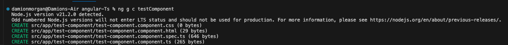
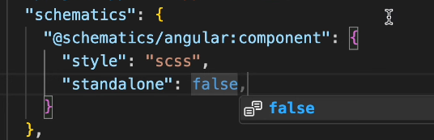

# TestProject

This project was generated with [Angular CLI](https://github.com/angular/angular-cli) version 17.3.0.

Youtube Tutorial from [ARCTUTORIALS](https://www.youtube.com/playlist?list=PLp50dWW_m40W6u4NxWCsQk1F8CmzBI6r0)
## Getting Started 
To install your angular project you first have to install the [Angular CLI](https://angular.io/cli). To do so enter the command into your terminal
`npm install -g @angular/cli`

To [Create Your Project](https://angular.io/tutorial/tour-of-heroes/toh-pt0) you simply type in `ng new <Project Name>`

To [Run Your Project](https://angular.io/cli/serve) you simply type in `ng serve`

## Angular CLI
*CLI* stands for Command Line Interace which is a terminal application that accepts input from the terminal to perform various tasks often making a developers life easier 

[Angular's CLI](https://angular.io/cli) can specifically 
* Generate a new angular Project `ng new <project name>`
* Get Version Information `ng version`
* Create components, module service pipe etc... `ng generate`
* Testing Your Code `ng test`
* Created Your Development Server `ng serve`
* Build for production `ng build`
* ng add (for angular pacakges/modules)
* ng update to update angular version

## Styling
It Appears that you have to use on or the other ??????
### Angular Material
You can install (`ng add @angular/material`) [Angular Material](https://material.angular.io/) for help creating your user interface it gives you a variety of components to use in your application

To use an angualar material component
  
* First Select the component you want to use (a [button](https://material.angular.io/components/button/overview) for this example)
* You will see three tabs overview, api and examples
* Click on the api tab then copy the import and paste into app.component.ts. You will see an array called imports add the the import inside of that array
  
  
  

### Bootstrap
* Install [Bootstrap](https://www.npmjs.com/package/bootstrap)(`npm i bootstrap`) and [BootStrap Icons](https://www.npmjs.com/package/bootstrap-icons)(`npm i bootstrap-icons`)

* Navigate to the angular.json and find the build object styles array there you want to add in both the files paths for bootstrap and bootstrap icons (`             "node_modules/bootstrap/dist/css/bootstrap.min.css",
              "node_modules/bootstrap-icons/font/bootstrap-icons.scss",`)

* Remove the angular material styles
* Next add in the scripts in the scripts array (`"node_modules/bootstrap/dist/js/bootstrap.min.js"`) 
    
    
    

## The Building Block of Angular

### Components 
Similar to react where your componets are just the individual parts of your website
* Header
* Footer
* Form 
* Nav
* Buttons etc...
  
To create your component you can use the ClI command `ng generate component/c <component_Name> ` or manually [create it](https://angular.io/api/core/Component)

 ### @Component
 is the basis of creating your component.
* selector- the name that is used to refer to the component
* standAlone - the are independent and dont need to be declared in an [ngModule](https://angular.io/guide/ngmodules) (yes by default)
* imports- since by default components are considered to be stand alone you have to add your imports such as buttons forms etc insde of the array
* templateUrl- there's no jsx equivalent in Angular so each component has it own html page. TemplateUrl takes the path for that html file
* template- alternatively if the html for component is small you have just write the html inside the template property as a string
* styleUrl-similar concept to the template url
* style-similar concept to tempalte

### Each
 Component will have its own folder with 6 files
* < componentName >.component.css - component's styling
* < componentName >.component.html- component's user interface
* < componentName >.component.ts-creating the component (where the @component goes)
* < componentName >.config.ts- configuration file
* < componentName >.routes.ts- routing 
* < componentName >.spec.ts- unit test

### Data Flow
* @input -  send data to the component
* @output - send data from the component

### Data Binding 
Data goes from class to template back to class

### Component LifeCycle Methods
Between the creation and descrutions of your component it will go through many [stages](https://angular.io/guide/lifecycle-hooks)

## Modular Architecture
In Angular 17 everything is now standalone meaning nothing relies on the ngmodule or appmodule as a newer person to angular i dont really care what was before just feel glad I hope on after such a big change. Now that all compoents by default are standalone they can be inject/used anywhere. Modules still works just not a default anymore.

### Creating Your Components
`ng generate component <name>` or `ng g c <name>` will create 4 files 

By adding  `-- standalone false` you are essentially reverting to a pervison version of how angular operates. Now that component must have module associated with it. To create a module `ng generate module <name>` or `ng g m <name>`. This will create folder of the same name with one file move that file to app folder and now create your dependent component.

Adding `--flat` will create the 4files just without its own folder

If you want all your components to be modular you can go to the angular.json and config it to do so
