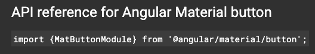
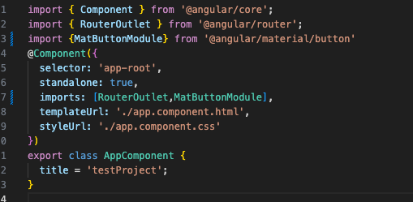
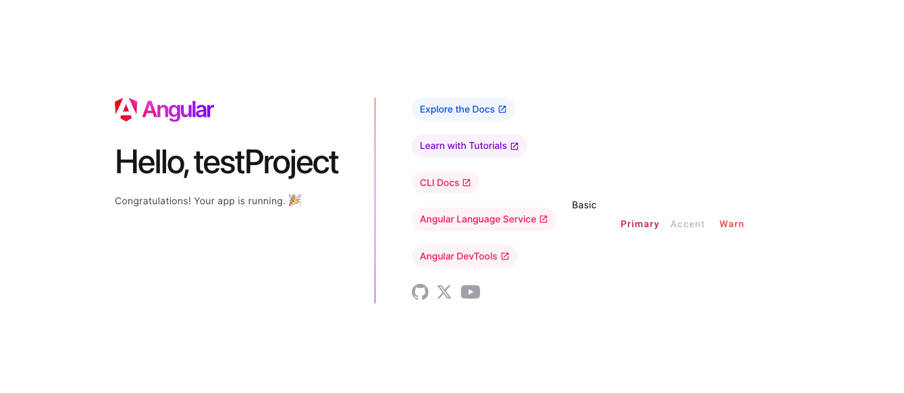
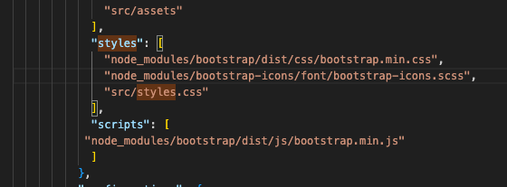

# TestProject

This project was generated with [Angular CLI](https://github.com/angular/angular-cli) version 17.3.0.

Youtube Tutorial from [ARCTUTORIALS](https://www.youtube.com/playlist?list=PLp50dWW_m40W6u4NxWCsQk1F8CmzBI6r0)
## Getting Started 
To install your angular project you first have to install the [Angular CLI](https://angular.io/cli). To do so enter the command into your terminal
`npm install -g @angular/cli`

To [Create Your Project](https://angular.io/tutorial/tour-of-heroes/toh-pt0) you simply type in `ng new <Project Name>`

To [Run Your Project](https://angular.io/cli/serve) you simply type in `ng serve`

## Styling
It Appears that you have to use on or the other ??????
### Angular Material
You can install (`ng add @angular/material`) [Angular Material](https://material.angular.io/) for help creating your user interface it gives you a variety of components to use in your application

To use an angualar material component
  
* First Select the component you want to use (a [button](https://material.angular.io/components/button/overview) for this example)
* You will see three tabs overview, api and examples
* Click on the api tab then copy the import and paste into app.component.ts. You will see an array called imports add the the import inside of that array
  
  
  

### Bootstrap
* Install [Bootstrap](https://www.npmjs.com/package/bootstrap)(`npm i bootstrap`) and [BootStrap Icons](https://www.npmjs.com/package/bootstrap-icons)(`npm i bootstrap-icons`)

* Navigate to the angular.json and find the build object styles array there you want to add in both the files paths for bootstrap and bootstrap icons (`             "node_modules/bootstrap/dist/css/bootstrap.min.css",
              "node_modules/bootstrap-icons/font/bootstrap-icons.scss",`)

* Remove the angular material styles
* Next add in the scripts in the scripts array (`"node_modules/bootstrap/dist/js/bootstrap.min.js"`) 
    
    
    