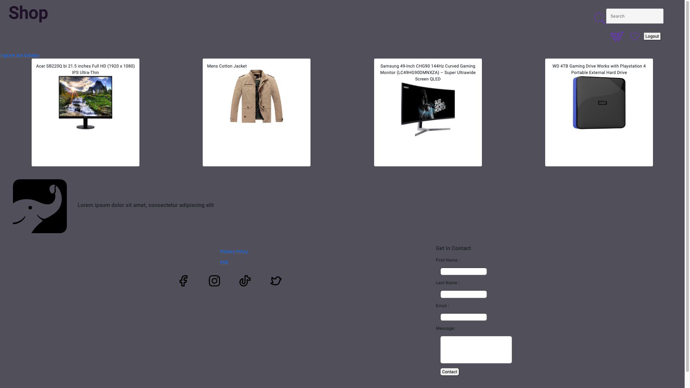
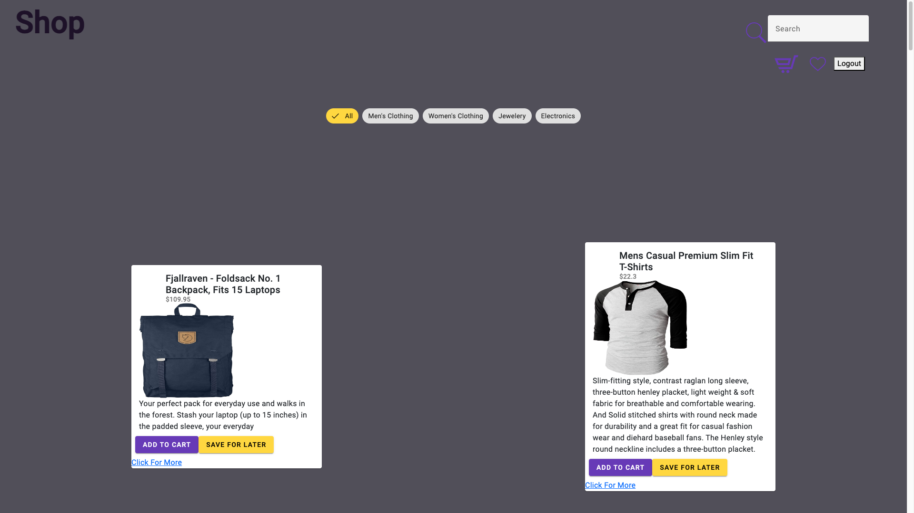
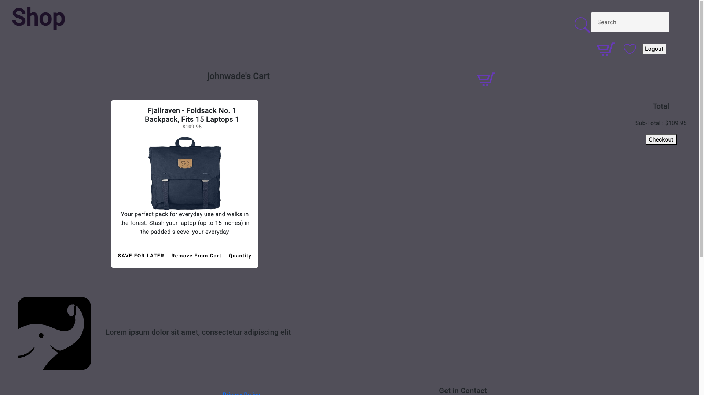
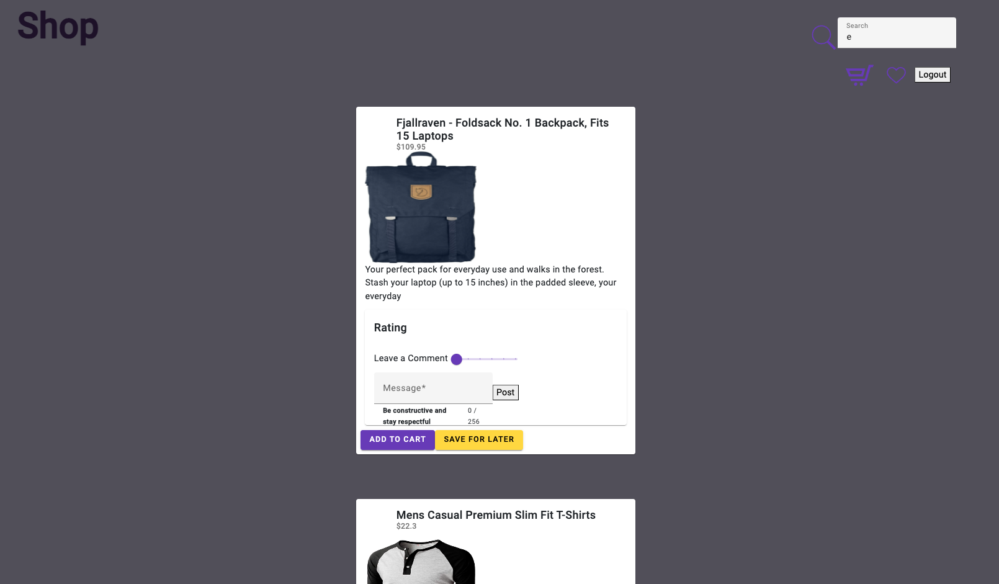
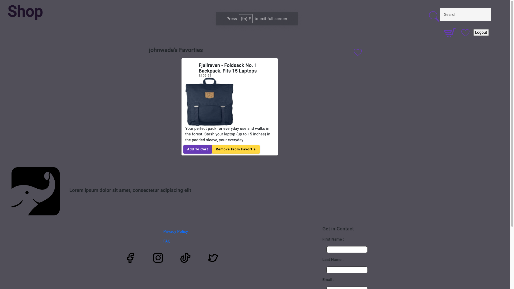

# Ecommerce Store
Meant to represent an Ecommerce Store where the user can create an account and buy items
## Installing
Simply Go to the [Deployed Website](https://angular-ts.onrender.com/) 
## Features
* View the Catalog of Items
* Filter based on catergory or search query
* Add items to their cart or Favorite 
* Post Reviews/Ratings on said Items

## Images

## Improvments
* Handling State Better ( having to reload to ge the update state)
* A Better handle of the sytanx 
* Removing Unecssary code (espcialy imports)
## Help
This was my first time using Angular and my first time using typescript so I'm sure there's alot of way I could have optimized the code but for a first time project I am proud of my abiilty to adapt and create a function full stack apllication 

## Authors

Contributors names and contact info

[Damion Morgan](https://github.com/BeginnerLevelUP)

## Version History

* 0.1
    * Initial Release

## License

This project has no license 

